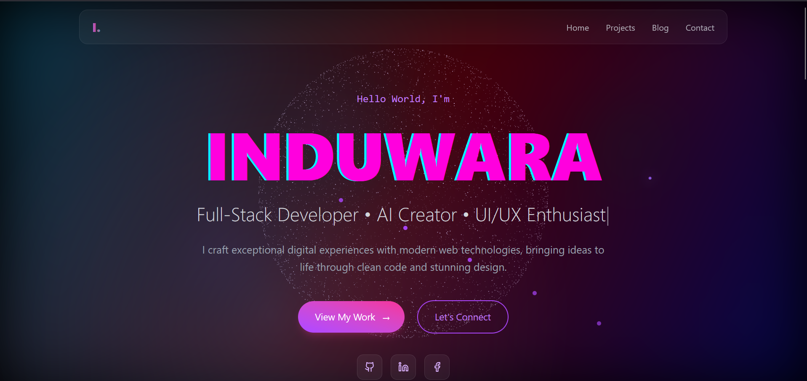
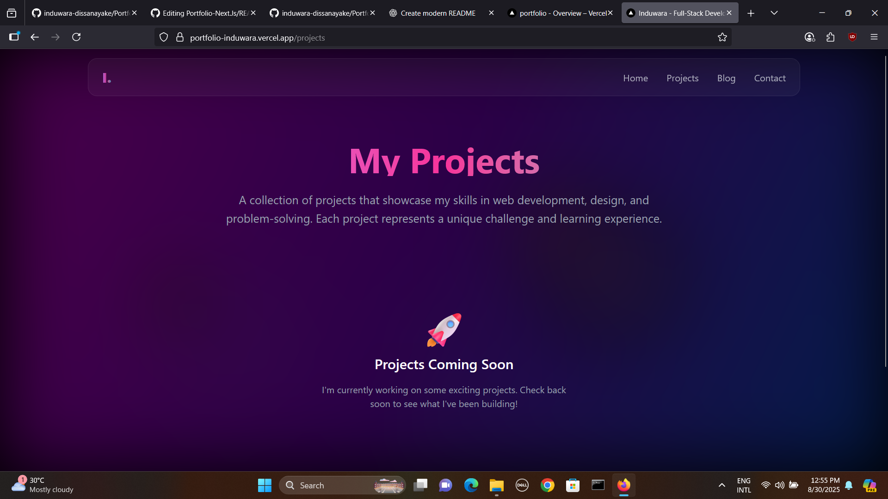
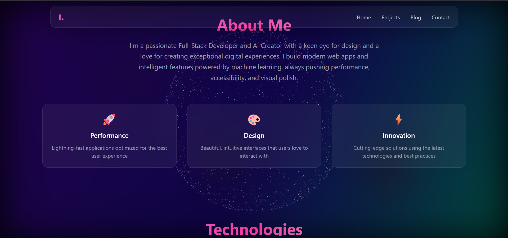
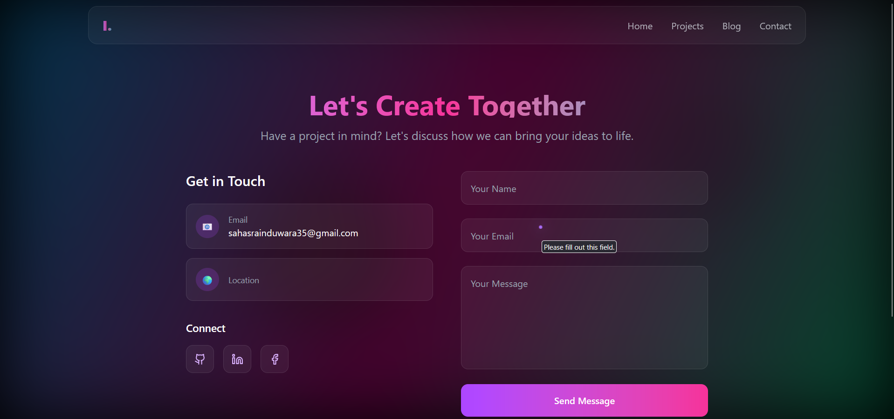
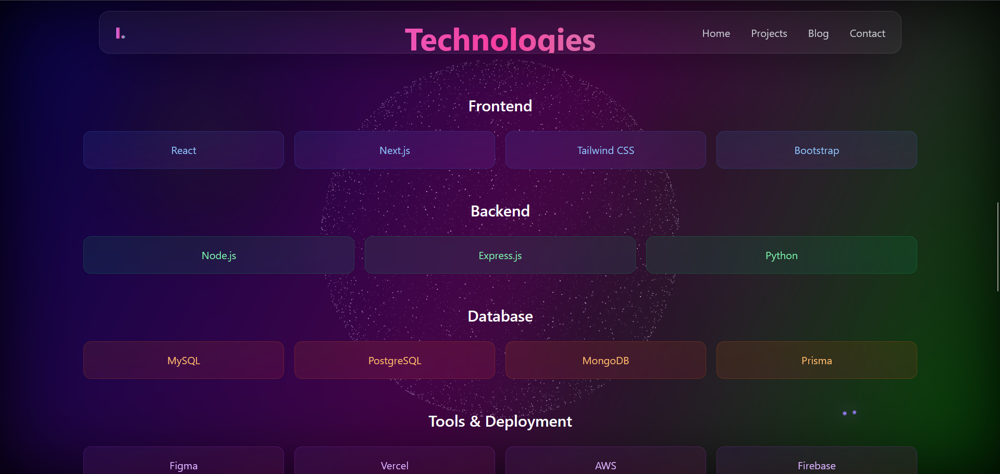

# 🌐 Personal Portfolio Website

A **modern portfolio website** built with **Next.js** and styled using **Tailwind CSS** with smooth **Framer Motion animations**.  
It highlights projects, skills, and achievements with a clean, minimal, and responsive design — hosted on **Vercel**.

🔗 **Live Demo:** [portfolio-induwara.vercel.app](https://portfolio-induwara.vercel.app/)

---

## ✨ Features

- ⚡ **Next.js (App Router)** for SSR & optimized performance  
- 🎨 **Tailwind CSS** for responsive, utility-first styling  
- 🌀 **Framer Motion** for smooth animations & transitions  
- 🗄️ **Prisma + PostgreSQL** for structured project/experience data  
- 📱 Fully **responsive design** (mobile → desktop)  
- 🚀 **Deployed on Vercel** with automatic builds & CI/CD  

---

## 📂 Sections

- **Hero** → Short intro & CTA  
- **About** → Education & background  
- **Skills** → Technical skillset with icons  
- **Projects** → Highlighted works with links to GitHub & live demos  
- **Experience** → Work / freelance experience  
- **Contact** → Direct contact form + social links  

---

## 📷 Screenshots

  
  
  
   
  

---

# 🎥 Demo Video

---

## 🧱 Tech Stack

- **Framework:** Next.js 13+ (React)  
- **Styling:** Tailwind CSS  
- **Animations:** Framer Motion  
- **Database/ORM:** Prisma + PostgreSQL  
- **Deployment:** Vercel  

---

## 📌 Project Status
This project is **live** and actively maintained as my personal portfolio.  

---

## ✍️ Author
**Induwara Dissanayake**  
📧 Email: sahasrainduwara35@gmail.com  
🌐 Portfolio: [portfolio-induwara.vercel.app](https://portfolio-induwara.vercel.app/)  
 

---
